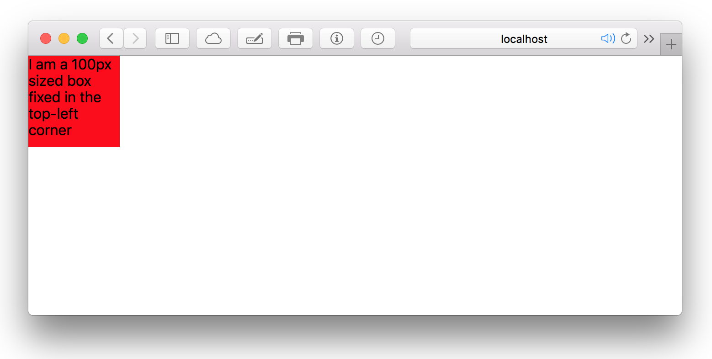

# Absolute
Absolute is component that is positioned `absolute`. <br>

### Props
| Property  | Value | Description |
| --- | --- | --- | --- |
| top | *(length)* | CSS `top` property |
| right | *(length)* | CSS `right` property |
| bottom | *(length)* | CSS `bottom` property |
| left | *(length)* | CSS `left` property |
| width | *(length)* | CSS `width` property |
| height | *(length)* | CSS `height` property |
| **Shortcuts** | | |
| fixed |  | Use `position: fixed` |

### Defaults
```CSS
{
  display: flex;
  position: absolute
}
```

### Example
```javascript
import { Absolute } from 'kilvin'

const FixedTopLeft = (
  <Absolute fixed
    height={100}
    width={100}
    left={0}
    top={0}
    style={{ backgroundColor: 'red' }}>
    I am a 100px sized box fixed in the top-left corner
  </Absolute>
)
```


