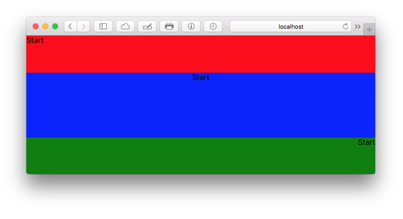

# Box
Box is probably the most important component. It is used to craft detailed layouts based on flexbox. It also defines box-model properties such as padding, margin and border.

### Props
| Property  | Value | Description |
| --- | --- | --- | --- |
| padding | *(length)* | CSS `padding` property |
| margin | *(length)* | CSS `margin` property |
| border | *(border-width)*, *(border-type)*,  *(border-color)* | CSS `border` property |
| borderWidth | *(length)* (1 - 4) | CSS `borderWidth` property |
| **Flexbox** | | |
| grow | *(number)* | CSS `flex-grow` property |
| shrink | *(number)* | CSS `flex-shrink` property |
| basis | *(length)* | CSS `flex-basis` property |
| flex | *(flex-grow)* *(flex-shrink)* *(flex-basis)* | CSS `flex` property |
| justifyContent | `flex-start`, `flex-end`, `center`, `space-between`, `space-around` | CSS `justify-content` property |
| alignContent | `flex-start`, `flex-end`, `center`, `space-between`, `space-around` | CSS `align-content` property |
| alignItems | `flex-start`, `flex-end`, `center`, `baseline`, `stretch` | CSS `align-items` property |
| alignSelf | `flex-start`, `flex-end`, `center`, `baseline`, `stretch` | CSS `align-self` property |
| order | *(number)* | CSS `order` property |
| **Shortcuts** | | |
| overflow |  | Use `overflow: visible` |
| flex |  | Use `flex: 1` |
| grow |  | Use `flex-grow: 1` |
| row |  | Use `flex-direction: row` |
| reverse |  | Reverse `flex-direction` |
| center |  | Use `justify-content: center; align-items: center` |
| inline |  | Use `display: inline-flex` |
| wrap |  | Use `flex-wrap: wrap` |
| wrapReverse | | Use `flex-wrap: wrap-reverse` |

### Defaults
```CSS
{
  display: flex;
  overflow: hidden;
  max-width: 100%;
  flex-shrink: 0;
  flex-basis: auto;
  flex-direction: column;
  flex-wrap: nowrap;
  align-content: flex-start;
  align-self: stretch
}
```

### Example
```javascript
import { Box } from 'kilvin'

const Centered = () => (
  <Box grow justifyContent='center'>
    <Box grow={1}
      alignItems='flex-start'
      style={{ backgroundColor: 'red' }}>
      Start
    </Box>
    <Box grow={2}
      alignItems='center'
      style={{ backgroundColor: 'blue' }}>
      Start
    </Box>
    <Box grow={1}
      alignItems='flex-end'
      style={{ backgroundColor: 'green' }}>
      Start
    </Box>
  </Box>
)
```

