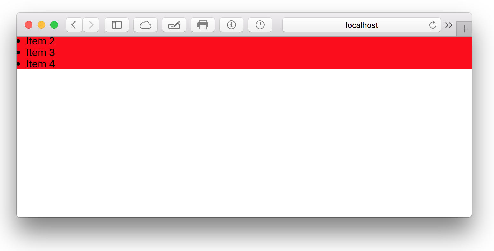

# ScrollView
ScrollView is a simple component adding scrollbars for overflowing content.

### Props
| Property  | Value | Description |
| --- | --- | --- | --- |
| width | *(length)* | CSS `width` property |
| height | *(length)* | CSS `height` property |
| flex | *(flex-grow)* *(flex-shrink)* *(flex-basis)* | CSS `flex` property |
| **Shortcuts** | | |
| horizontal |  | Enable horizontal *(instead of vertical)* scrolling  |

### Defaults
```CSS
{
  display: flex;
  -webkit-overflow-scrolling: touch;
  overflow-x: hidden;
  overflow-y: auto;
  height: 100%;
  width: 100%
}
```

### Example
```javascript
import { ScrollView } from 'kilvin'

const List = () => (
  <ScrollView height={50} style={{ backgroundColor: 'red' }}>
    <li>Item 1</li>
    <li>Item 2</li>
    <li>Item 3</li>
    <li>Item 4</li>
    <li>Item 5</li>
    <li>Item 6</li>
    <li>Item 7</li>
    <li>Item 8</li>
    <li>Item 9</li>
  </ScrollView>
)
```

