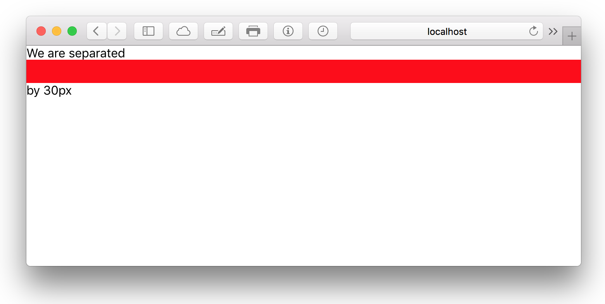

# Spacer
Spacer simply adds (vertical) whitespace.

### Props
| Property  | Value | Description |
| --- | --- | --- | --- |
| size | *(length)* | Whitespace size |
| **Shortcuts** | | |
| horizontal |  | Use horizontal whitespace  |

### Defaults
```CSS
{
  display: flex;
}
```

### Example
```javascript
import { Spacer, Box } from 'kilvin'

const VerticalSpace = () => (
  <Box>
    <Box>We are separated</Box>
    <Spacer size={30} />
    <Box>by 30px</Box>
  </Box>
)
```

