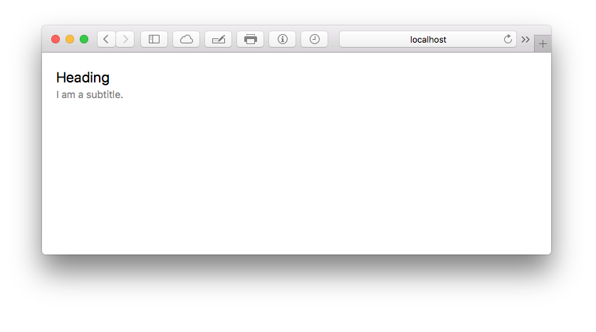

# Text

### Props
| Property  | Value | Description |
| --- | --- | --- | --- |
| fontFamily | *(font-family)* | CSS `font-family` property |
| size | *(length)* | CSS `font-size` property |
| height | *(length)*, *(number)* | CSS `line-height` property |
| weight | `normal`, `bold`, `bolder`, `lighter`, `100`, `200`, `300`, `400`, `500`, `600`, `700`, `800`, `900` | CSS `font-weight` property |
| color | *(color)* | CSS `color` property |
| **Shortcuts** | | |
| bold |  | Use `font-weight: 700`  |
| italic |  | Use `font-style: italic`  |
| **Extends**<br> Requires [fela-plugin-extend](https://github.com/rofrischmann/fela/tree/master/packages/fela-plugin-extend) to be present  | | |
| antialiased |  | Use `-webkit-font-smoothing: antialiased; -moz-osx-font-smoothing: grayscale`  |
| ellipsis |  | Use `text-overflow: ellipsis; overflow: hidden; white-space: nowrap`  |

### Defaults
```CSS
{
  font-weight: 400
}
```

### Example
```javascript
import { Text, Box } from 'kilvin'

const Preview = () => (
  <Box padding={20}>
    <Text size={20} height={1.5}>
      Heading
    </Text>
    <Text size={14} color='grey'>
      I am a subtitle.
    </Text>
  </Box>
)
```

