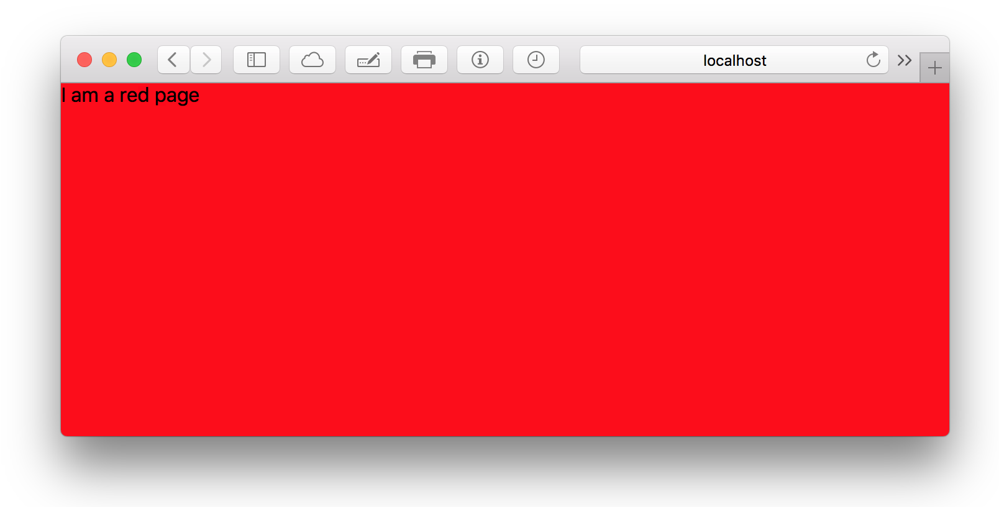

# View
View wraps applications and pages into a fixed, screen-fitting wrapper.

### Props
| Property  | Value | Description |
| --- | --- | --- | --- |
| zIndex | *(number)* | CSS `z-index` property |
| **Shortcuts** | | |
| hidden |  | Use `display: none`  |

### Defaults
```CSS
{
  display: flex;
  position: fixed;
  top: 0;
  left: 0;
  bottom: 0;
  right: 0
}
```

### Example
```javascript
import { View } from 'kilvin'

const App = () => (
  <View style={{ backgroundColor: 'red' }}>
    I am a red page
  </View>  
)
```

